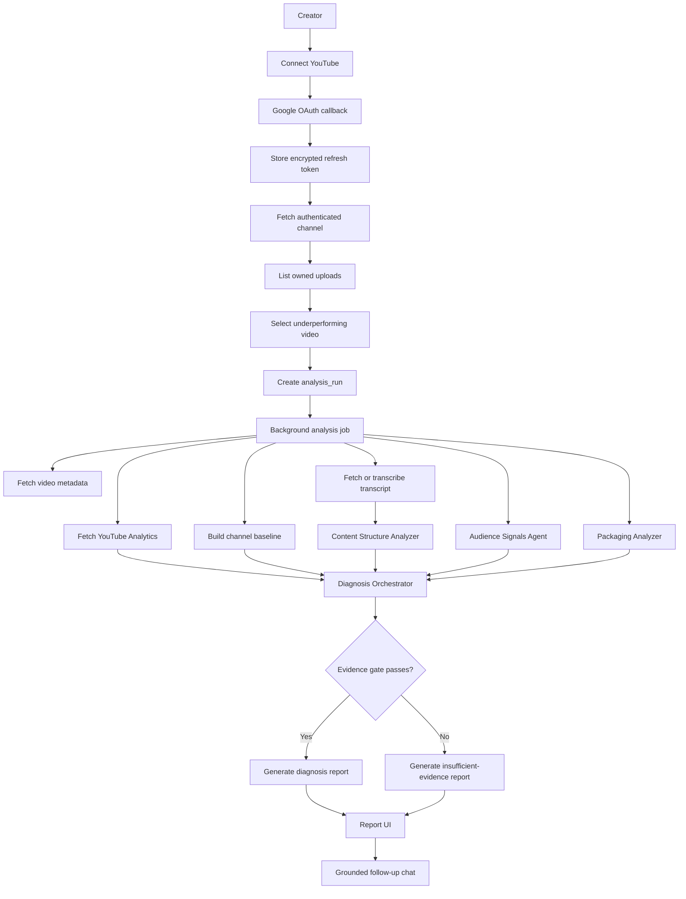

# Architecture

## Product Architecture Summary

The pivot product is a YouTube performance diagnosis system. It is report-first, OAuth-connected, analytics-heavy, and LLM-assisted.

The central object is an `analysis_run`. A creator connects YouTube, selects one owned video, and the backend runs a background analysis job. The job fetches private analytics, builds a channel baseline, analyzes transcript and comments, applies deterministic evidence gates, and stores a reproducible analysis snapshot. The LLM turns the stored diagnosis JSON into a structured report and grounded follow-up answers.

MVP diagnosis is OAuth-first, owned-video, and long-form-only. Public URL analysis and Shorts diagnosis are not the core MVP path.

## Stack

- Frontend: Next.js, React, TypeScript.
- Backend: FastAPI.
- Database: Postgres.
- Migrations: Alembic.
- Vector DB: Qdrant Cloud for transcript and evidence retrieval.
- Auth: Google OAuth with YouTube read-only scopes.
- YouTube APIs: YouTube Data API and YouTube Analytics API.
- Media extraction: `yt-dlp`, `ffmpeg`.
- Transcription: YouTube transcript fast path, Groq `whisper-large-v3` fallback.
- LLM: Groq chat model during MVP development, isolated behind a provider wrapper.
- Embeddings: FastEmbed `BAAI/bge-small-en-v1.5` unless changed deliberately.
- CI: provider-mocked tests for Google, YouTube, Groq, Qdrant, and Postgres-sensitive behavior.

## Runtime Flow

## Core Backend Domains

### Auth

Google OAuth is the MVP login mechanism.

Responsibilities:

- start OAuth;
- handle callback;
- validate identity;
- store user record;
- store encrypted refresh token;
- refresh short-lived access tokens server-side;
- support disconnect;
- support data deletion.

### Channel And Video Selection

The backend fetches authenticated channel identity and recent owned uploads. Pasted URLs are accepted only after ownership is verified.

MVP selection is manual. The video list should not precompute private analytics for every upload or auto-rank underperformers. Private analytics are fetched after one video is selected, limited to the selected video and baseline candidates needed for that `analysis_run`.

If the authenticated Google account exposes multiple channels or brand accounts, the backend stores each channel and the frontend allows one active channel selection for MVP. Every video list, ownership check, analysis run, and report access check is scoped by both `user_id` and `youtube_channel_id`.

Shorts are detected and rejected from MVP diagnosis, while keeping `is_short` in snapshots so future Shorts-specific diagnosis can be added cleanly.

### Analysis Runs

`analysis_run` replaces the old `session` product concept.

Responsibilities:

- track status and progress;
- identify user and channel;
- identify selected video;
- track whether the run is a full first-7-day diagnosis or lower-confidence early read;
- store run configuration;
- own all snapshots, reports, comments, chunks, and follow-up messages.

MVP execution uses FastAPI background tasks, not a durable queue. The `analysis_run` state machine must be explicit enough to migrate later to Celery, RQ, Cloud Tasks, or another durable runner without changing frontend APIs.

Expected statuses:

- `queued`
- `running`
- `needs_input`
- `completed`
- `failed`

Analyzer steps should be idempotent where practical. Do not silently retry a whole run forever; record step-level failures, retry bounded transient operations, and surface a readable terminal failure when needed.

Whole-run retry, refresh, and manual-context revision create a new `analysis_run` linked to the prior run with `parent_analysis_run_id`. The prior run remains immutable for auditability. Retries may reuse safe cached artifacts such as metadata or transcript, but the new run must record what was reused. Refreshes should fetch fresh private analytics. Manual context that changes interpretation should create a revision, not silently mutate the original report.

Expected `run_reason` values:

- `initial`
- `retry`
- `refresh`
- `manual_context_revision`

### Analysis Snapshot

Snapshots preserve the exact data used to create a report.

They should include:

- selected video metadata;
- normalized private analytics;
- baseline membership and metrics;
- retention points;
- transcript chunks;
- comment samples and derived audience signals;
- packaging signals;
- manual metrics or user context, labeled separately from platform evidence;
- deterministic diagnosis JSON.

### Report

The report is generated from deterministic diagnosis JSON plus compact evidence objects. The report must not include claims that cannot be traced to stored evidence.

The backend validates report JSON before display. Validation checks required sections, citation existence, bottleneck consistency with deterministic diagnosis JSON, insufficient-evidence preservation, and absence of unsupported metric claims. On validation failure, the backend retries generation with validation errors; if that still fails, it returns a deterministic fallback report.

### Follow-Up Chat

Chat is attached to a report. It can explain, rewrite, and reformat within the analysis snapshot. It cannot invent fresh analytics.

Fresh analytics, changed diagnosis, manual context enrichment, and refresh flows must create explicit new analysis events or revisions rather than silently mutating the original report.

## Expected Database Tables

### `users`

- `id`
- `google_sub`
- `email`
- `name`
- `avatar_url`
- `created_at`
- `updated_at`

### `youtube_channels`

- `id`
- `user_id`
- `youtube_channel_id`
- `title`
- `thumbnail_url`
- `created_at`
- `updated_at`

### `oauth_tokens`

- `id`
- `user_id`
- `provider`
- `scope`
- `encrypted_refresh_token`
- `access_token_expires_at`
- `created_at`
- `updated_at`

Access tokens should not be persisted unless there is a specific need. Refresh tokens must be encrypted at rest.

### `analysis_runs`

- `id`
- `parent_analysis_run_id`
- `run_reason`
- `user_id`
- `youtube_channel_id`
- `selected_video_id`
- `selected_video_url`
- `status`
- `current_step`
- `progress_percent`
- `started_at`
- `completed_at`
- `failed_at`
- `is_early_read`
- `comparison_window`
- `confidence_score`
- `confidence_label`
- `primary_bottleneck`
- `insufficient_evidence`
- `error`
- `created_at`
- `updated_at`

### `analysis_video_snapshots`

- `id`
- `analysis_run_id`
- `youtube_video_id`
- `title`
- `description`
- `thumbnail_url`
- `published_at`
- `duration_seconds`
- `is_short`
- `raw_youtube_data`
- `created_at`

### `analysis_metric_snapshots`

- `id`
- `analysis_run_id`
- `metric_scope`
- `time_window`
- `metrics`
- `created_at`

`metric_scope` examples: `selected_video`, `baseline_median`, `baseline_video`.

Manual metrics such as user-provided CTR or impressions must not be written into this table as if they were fetched from YouTube.

### `analysis_baseline_videos`

- `id`
- `analysis_run_id`
- `youtube_video_id`
- `title`
- `published_at`
- `duration_seconds`
- `include_reason`
- `exclude_reason`
- `metrics`
- `created_at`

### `analysis_retention_points`

- `id`
- `analysis_run_id`
- `timestamp_seconds`
- `elapsed_video_ratio`
- `audience_watch_ratio`
- `baseline_audience_watch_ratio`
- `delta_from_baseline`
- `mapped_transcript_chunk_id`
- `created_at`

### `analysis_comment_signals`

- `id`
- `analysis_run_id`
- `raw_sample`
- `timestamp_reactions`
- `theme_summary`
- `viewer_language`
- `limitations`
- `created_at`

Missing, disabled, sparse, or generic comments should be represented as unavailable or limited evidence, not negative evidence.

### `analysis_manual_evidence`

- `id`
- `analysis_run_id`
- `evidence_type`
- `label`
- `value`
- `source_note`
- `created_at`

`evidence_type` examples: `manual_metric`, `user_context`, `manual_transcript`, `reference_expectation`.

Manual evidence can improve a diagnosis but must remain labeled as user-provided in reports and citations.

Manual context should be structured-first. Expected fields include `expected_performance`, `problem_observed`, `manual_metrics`, `intended_audience`, and `notes`. Free-form notes are allowed, but structured fields should drive deterministic gates and targeted missing-data prompts.

### `analysis_reports`

- `id`
- `analysis_run_id`
- `diagnosis_json`
- `report_json`
- `report_markdown`
- `citations`
- `validation_status`
- `validation_errors`
- `created_at`
- `updated_at`

### `analysis_report_feedback`

- `id`
- `analysis_run_id`
- `useful`
- `matches_youtube_studio`
- `note`
- `copied_outputs`
- `created_at`

Feedback is product-validation data. It should not mutate the diagnosis, become chat memory, or be treated as platform evidence.

### `analysis_followup_messages`

- `id`
- `analysis_run_id`
- `role`
- `content`
- `sources`
- `created_at`

### `analysis_usage_ledger`

- `analysis_run_id`
- `youtube_api_calls`
- `youtube_analytics_queries`
- `transcribed_seconds`
- `chunk_count`
- `embedding_count`
- `llm_prompt_tokens`
- `llm_completion_tokens`
- `created_at`
- `updated_at`

## Vector Payload

Transcript and evidence chunks should use `analysis_run_id`, not legacy `session_id`.

Expected payload fields:

- `analysis_run_id`
- `youtube_video_id`
- `chunk_type`
- `chunk_index`
- `text`
- `start_time`
- `end_time`
- `is_hook`
- `source_tag`
- `transcript_source`

Potential `chunk_type` values:

- `transcript`
- `comment_sample`
- `packaging_note`
- `report_evidence`
- `manual_transcript`

## API Direction

Expected MVP endpoints:

- `GET /health`
- `GET /auth/google/start`
- `GET /auth/google/callback`
- `GET /me`
- `POST /youtube/disconnect`
- `DELETE /me/analysis-data`
- `GET /youtube/channels`
- `POST /youtube/channels/active`
- `GET /youtube/videos`
- `POST /analysis-runs`
- `GET /analysis-runs/{analysis_run_id}`
- `GET /analysis-runs/{analysis_run_id}/report`
- `POST /analysis-runs/{analysis_run_id}/feedback`
- `POST /analysis-runs/{analysis_run_id}/manual-evidence`
- `POST /analysis-runs/{analysis_run_id}/refresh`
- `POST /analysis-runs/{analysis_run_id}/retry`
- `POST /analysis-runs/{analysis_run_id}/followups`

Legacy `/ingest`, `/status/{session_id}`, `/messages/{session_id}`, and `/chat` can remain temporarily while migration is underway, but new product work should target the `analysis-runs` API.

## Analyzer Contracts

Analyzers must emit compact typed JSON.

### Analytics Signal Analyzer

Owns:

- private metrics;
- same-window channel baseline, defaulting to first 7 completed days;
- trend analysis;
- retention metrics;
- traffic and engagement signals;
- subscriber signals.

Returns candidate quantitative signals and limitations.

### Content Structure Analyzer

Owns:

- transcript chunks;
- hook timing;
- payoff timing;
- pacing sections;
- retention-to-transcript mapping.

Returns timestamped content evidence.

Precise hook or pacing diagnosis requires retention curve evidence or equivalent manual retention evidence. Transcript-only critique can support content interpretation, but it does not prove where viewers left.

### Audience Signals Agent

Owns:

- comment fetch;
- raw comment storage;
- timestamp extraction;
- sentiment and theme clustering;
- viewer-language extraction.

Returns compact comment evidence with sample counts and limitations.

Comment evidence is bounded supporting evidence. Comments can satisfy the content-or-audience gate, but comments alone cannot create high confidence.

### Packaging Analyzer

Owns:

- title clarity;
- description/topic framing;
- stored thumbnail display context;
- user-provided packaging context;
- optional manual CTR/impression context.

Returns packaging signals and confidence.

CTR and impressions are optional/manual for MVP unless a verified platform path is added. Without click-opportunity evidence, packaging confidence is capped and packaging cannot be high-confidence primary diagnosis.

MVP does not include automated thumbnail vision analysis. A future `ThumbnailVisionAnalyzer` can be added only with compact typed outputs and citations.

### Diagnosis Orchestrator

Owns:

- evidence gates;
- candidate bottleneck scoring;
- contradiction checks;
- confidence;
- deterministic diagnosis JSON.

The orchestrator, not the LLM, chooses primary and secondary bottlenecks.

### Coach LLM

Owns:

- report prose;
- coaching tone;
- hook and title rewrites;
- next-video plan;
- grounded follow-up responses.

The LLM cannot invent analytics or choose the primary bottleneck outside the deterministic diagnosis JSON.

## Evidence Gate

A report may name a primary bottleneck only when the run has:

- one authenticated analytics signal for the selected video in the comparison window;
- at least 5 comparable prior long-form videos in the same-window baseline;
- one content or audience signal;
- one candidate bottleneck that scores materially stronger than alternatives;
- one contradiction check showing why another plausible bottleneck is less likely;
- confidence tied to data completeness.

Otherwise, the report must use the insufficient-evidence structure.

If there are fewer than 5 comparable prior long-form videos, the run can complete but cannot name a confident primary bottleneck. With `0-2` comparable videos, show no primary diagnosis. With `3-4`, show low-confidence ranked hypotheses.

Confidence is stored as both `confidence_score` (`0.0-1.0`) and `confidence_label` (`low`, `medium`, `medium_high`, `high`). User-facing reports should show labels and reasons, not percentages.

## Baseline And Window Policy

- Default comparison window: first 7 completed days after publish.
- Early read: selected video is 72 hours to 7 days old; compare against the same available window with lower confidence.
- Under 72 hours: allow snapshot creation, but avoid primary bottleneck diagnosis unless signals are unusually strong.
- Baseline uses medians over comparable prior long-form videos.
- Exclude Shorts, live-first videos, trailers, announcements, non-standard uploads, future videos, incomplete analytics, duration mismatches outside 50%-200%, and viral outliers above a clear threshold unless intentionally comparing against winners.

## Report Evidence UI

The report UI is compact-first and evidence-card-first. MVP should use the embedded YouTube player with timestamped evidence cards rather than generated video clips.

Evidence cards should include:

- timestamp range;
- player seek action;
- transcript excerpt when available;
- metric delta or baseline comparison;
- interpretation;
- recommended action;
- machine-readable citations.

## Citation Schema

Every factual report claim must cite stored evidence. Citation objects use typed source references:

- `analytics_metric`
- `baseline_metric`
- `baseline_video`
- `retention_point`
- `transcript_interval`
- `comment_signal`
- `packaging_signal`
- `manual_metric`
- `user_context`

Reports with invalid citations must not be displayed as finished diagnoses.

## Transcript Policy

Transcript acquisition runs in layers:

1. YouTube transcript/caption fast path.
2. Groq Whisper fallback from audio.
3. Optional user-provided transcript or script.

Use bounded retries:

- captions: 2 transient retries, no retry for permanent unavailable/disabled states;
- Whisper: 2 transient retries while respecting backpressure and duration limits.

If transcript remains unavailable, continue analytics-first diagnosis, mark transcript limitations, and ask whether the user has a script or transcript. Do not claim content-structure causes without transcript, script, or cited interval evidence.

## Data Retention

Reports and immutable analysis snapshots are retained until the user deletes them or deletes the account. The system does not continuously sync or warehouse the creator's whole channel.

Deletion must remove DB rows and Qdrant vectors for reports, snapshots, comments, manual evidence, transcript chunks, follow-ups, and analysis runs tied to the user.

## Security Notes

- Refresh tokens are encrypted at rest.
- Tokens never go to the frontend.
- Tokens are never logged.
- OAuth scopes are read-only in MVP and requested during initial YouTube connection.
- Disconnect revokes or invalidates stored OAuth access.
- Delete-data flow removes stored reports, snapshots, comments, vectors, and follow-up messages for the user.

## Migration Notes

The current codebase still contains old two-video comparison concepts. During migration:

- keep old code working only as long as needed;
- do not extend old A/B comparison routes for new product behavior;
- add Alembic before new schema work;
- migrate Qdrant payload filters from `session_id` to `analysis_run_id`;
- update frontend from chat-first to report-first.

## Quality Gates

- Unit tests for OAuth state handling and token storage.
- Unit tests for baseline selection.
- Unit tests for evidence gates.
- Unit tests for retention-to-transcript mapping.
- Provider-mocked tests for YouTube Data API and YouTube Analytics API wrappers.
- Provider-mocked tests for Audience Signals Agent output shape.
- Frontend typecheck and build.
- `make ci` before PR when practical.
