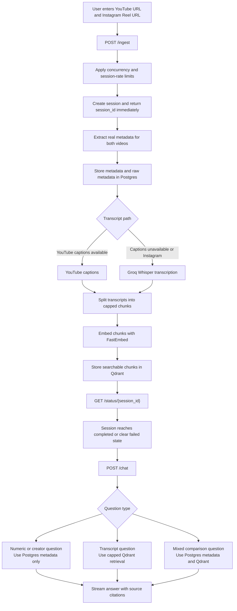

# Creator Video RAG Comparator

This app compares one YouTube video and one Instagram Reel. It collects video metadata, gets transcripts, stores the useful text for search, and lets a user ask questions in a chat window. The answers stream back with citations, so the user can see whether each fact came from video metadata or transcript text.

The project is built for a demo flow:

```text
YouTube URL + Instagram Reel URL
-> ingest both videos
-> store metadata and transcripts
-> mark the session completed
-> answer chat questions with citations
```

## Demo

Add a short GIF or video here that shows:

- entering one YouTube URL and one Instagram Reel URL
- ingest progress reaching `completed`
- asking a question
- receiving a streamed cited answer

<!-- Demo GIF or video placeholder -->

## Documentation

| Document | What It Explains | Best For |
| --- | --- | --- |
| [Product Spec](.codex/PRODUCT_SPEC.md) | Product goal, user needs, and expected behavior | Product reviewers |
| [Architecture](.codex/ARCHITECTURE.md) | System design, API flow, database tables, and quality gates | Engineers |
| [Plans](.codex/PLANS.md) | Phase milestones and acceptance criteria | Reviewers and maintainers |
| [Progress](.codex/Progress.md) | Work completed, checks run, and current next steps | Anyone tracking status |
| [Phase 1](docs/phase/phase-1.md) | Thin vertical slice scope and flow | Demo setup |
| [Phase 2](docs/phase/phase-2.md) | Grounded intelligence and eval scope | RAG quality work |
| [Phase 3](docs/phase/phase-3.md) | Product UI scope | Frontend polish |
| [Phase 4](docs/phase/phase-4.md) | CI, smoke tests, and demo readiness | Release readiness |
| [Agent Notes](AGENTS.md) | Developer workflow and important project decisions | Contributors |

## Technologies

| Area | Technology | Purpose |
| --- | --- | --- |
| Frontend | Next.js, React, TypeScript | Web app, video inputs, status display, and chat UI |
| Backend API | FastAPI | Ingest, status, messages, health, and chat endpoints |
| Orchestration | LangGraph | Routes each question to metadata, transcript search, or both |
| Chat model | Groq `llama-3.3-70b-versatile` | Streams final chat answers |
| Transcription | Groq `whisper-large-v3` | Creates transcripts when captions are unavailable |
| YouTube captions | `youtube-transcript-api` | Fast transcript path for YouTube videos with captions |
| Media extraction | `yt-dlp`, `ffmpeg` | Reads video metadata and downloads temporary audio |
| Embeddings | FastEmbed `BAAI/bge-small-en-v1.5` | Converts transcript chunks into vectors |
| Vector database | Qdrant Cloud | Stores and searches transcript chunks |
| Relational database | Neon Postgres | Stores sessions, video metadata, raw metadata, cache, chat history, and usage ledger |
| Backend tests | Pytest | Runs unit and mocked smoke tests |
| Backend lint | Ruff | Checks and formats Python code |
| Frontend checks | ESLint, TypeScript, Next build | Checks frontend code and production build |
| Markdown checks | markdownlint | Keeps documentation readable and consistent |
| CI | GitHub Actions | Runs lint, tests, build, markdown lint, and mocked smoke test |

## High-Level Pipeline



The app should not silently fall back to fake data. If a provider fails, the session or video should show a clear error.

## Installation Guide

### 1. Install System Tools

Install these first:

- Python 3.11 or newer
- Node.js 22 or newer
- npm
- `ffmpeg`

`ffmpeg` is needed for reliable audio extraction before transcription.

### 2. Create Environment File

Copy the example file:

```bash
cp .env.example .env
```

Then fill in these required values in `.env`:

| Variable | What It Is For |
| --- | --- |
| `GROQ_API_KEY` | Groq chat and Whisper transcription |
| `DATABASE_URL` | Neon Postgres connection string |
| `QDRANT_URL` | Qdrant Cloud URL |
| `QDRANT_API_KEY` | Qdrant Cloud API key |

Optional values are already shown in [.env.example](.env.example).
By default, the backend can start when Qdrant is temporarily unreachable and `/health` will show `qdrant: false`.
Set `REQUIRE_QDRANT_ON_STARTUP=true` if you want startup to fail when Qdrant validation fails.

Useful backpressure limits:

| Variable | Default | What It Controls |
| --- | --- | --- |
| `MAX_VIDEO_SECONDS` | `600` | Audio download and Groq Whisper window when captions are unavailable |
| `MAX_CONCURRENT_INGESTIONS` | `2` | Active background ingestion sessions accepted by one backend process |
| `MAX_CHUNKS_PER_VIDEO` | `120` | Maximum transcript chunks embedded and stored for each video |
| `MAX_CHAT_HISTORY_MESSAGES` | `12` | Recent chat messages loaded for prompt context and UI reload |
| `MAX_RETRIEVED_CHUNKS` | `8` | Maximum transcript chunks passed into a chat answer |
| `MAX_SESSIONS_PER_IP_PER_HOUR` | `20` | Ingest sessions accepted per IP per hour |

### 3. Install Backend

```bash
python -m venv backend/.venv
backend/.venv/bin/python -m pip install -r backend/requirements.txt
```

For development checks, install the dev tools too:

```bash
backend/.venv/bin/python -m pip install -r backend/requirements-dev.txt
```

### 4. Install Frontend

```bash
cd frontend
npm ci
cd ..
```

### 5. Start Backend

```bash
backend/.venv/bin/uvicorn backend.app.main:app --reload --reload-dir backend/app
```

The backend starts at `http://127.0.0.1:8000`.

### 6. Start Frontend

In a second terminal:

```bash
cd frontend
npm run dev
```

Open `http://localhost:3000`.

If port `3000` is already busy, Next.js may choose another port such as `3001`.

## Local Checks

Run the same checks as CI:

```bash
make ci
```

This runs:

- backend lint
- backend tests
- frontend lint
- frontend typecheck
- frontend build
- markdown lint
- mocked smoke test

The required CI path uses mocked tests only. It does not need real Groq, Qdrant Cloud, Neon, YouTube, or Instagram access. Real-provider checks should be manual or nightly, not required for every commit.

## Assignment Evals

After ingesting a real YouTube + Instagram session and waiting for `completed`, run:

```bash
backend/.venv/bin/python scripts/eval_assignment_questions.py \
  --api-base http://127.0.0.1:8000 \
  --session-id <completed-session-id>
```

The eval asks the assignment questions plus harder stats, vague, creative, open-ended, multi-step, and incorrect-premise questions. It checks that:

- the response streamed successfully
- the answer is not empty
- the answer has citations
- the selected route and retrieval policy match the question type
- numeric answers match Postgres metadata
- missing counts or unsupported metrics are stated as unavailable
- hook answers cite only early chunks
- mixed and recommendation answers cite transcript evidence from both videos

## Useful Commands

| Command | Purpose |
| --- | --- |
| `make backend-lint` | Run Ruff checks for Python |
| `make backend-tests` | Run backend tests except smoke |
| `make mocked-smoke` | Run the provider-mocked API smoke test |
| `make frontend-lint` | Run frontend ESLint |
| `make frontend-typecheck` | Run TypeScript checks |
| `make frontend-build` | Build the Next.js app |
| `make markdown-lint` | Check Markdown files |
| `make ci` | Run all required checks |
