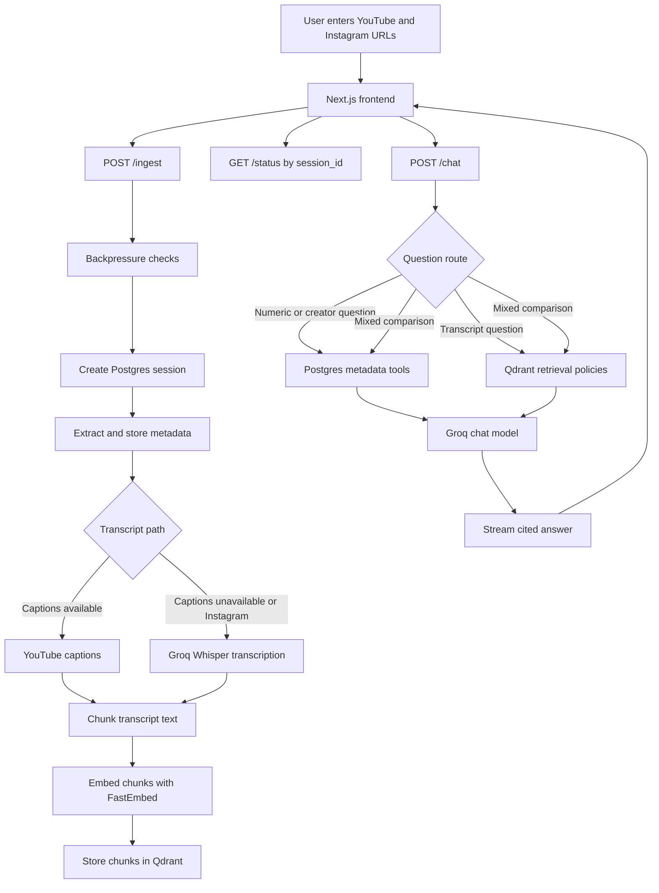

# Creator Video RAG Comparator

## Project overview

This app compares one YouTube video and one Instagram Reel. It extracts metadata, gets transcripts, stores searchable transcript chunks, and answers questions in a streaming chat UI with citations.

The goal is simple: help a user understand why two creator videos performed differently, using real metadata and transcript evidence instead of invented facts.

Leave space here for the demo media:

<!-- Demo GIF or video placeholder -->

### Project documents

| Document | What It Explains | Best For |
| --- | --- | --- |
| [Product Spec](.codex/PRODUCT_SPEC.md) | Product goal, user needs, and expected behavior | Product reviewers |
| [Architecture](.codex/ARCHITECTURE.md) | System design, API flow, database tables, and quality gates | Engineers |
| [Plans](.codex/PLANS.md) | Phase milestones and acceptance criteria | Reviewers and maintainers |
| [Progress](.codex/Progress.md) | Work completed, checks run, and current next steps | Anyone tracking status |
| [Installation](docs/installation.md) | Setup, environment variables, local run commands, and Render deployment | Developers running the app |
| [Phase 1](docs/phase/phase-1.md) | Thin vertical slice scope and flow | Demo setup |
| [Phase 2](docs/phase/phase-2.md) | Grounded intelligence and eval scope | RAG quality work |
| [Phase 3](docs/phase/phase-3.md) | Product UI scope | Frontend polish |
| [Phase 4](docs/phase/phase-4.md) | CI, smoke tests, and demo readiness | Release readiness |
| [Agent Notes](AGENTS.md) | Developer workflow and important project decisions | Contributors |

## Features

- Ingests two video URLs in one session.
- Supports YouTube and Instagram video slots.
- Returns a `session_id` immediately from ingestion.
- Stores video metadata and raw extractor metadata in Postgres.
- Uses YouTube captions first when they are available.
- Uses Groq `whisper-large-v3` for hosted transcription when captions are unavailable.
- Chunks transcripts and stores vectors in Qdrant.
- Streams chat answers with source citations.
- Routes numeric questions to Postgres metadata instead of vector search.
- Routes transcript questions to Qdrant retrieval.
- Uses balanced retrieval for comparison questions so both videos are represented.
- Includes evals for the assignment questions and harder edge cases.
- Includes provider-mocked CI so regular checks do not need real Groq, Neon, Qdrant, YouTube, or Instagram access.

## Architecture



The app does not silently fall back to fake data. If a provider fails, the session or video should show a clear error.

## Tech stack

| Area | Technology | Purpose |
| --- | --- | --- |
| Frontend | Next.js, React, TypeScript | Video inputs, status display, runtime limits, and chat UI |
| Backend API | FastAPI | Ingest, status, messages, health, config, and chat endpoints |
| Orchestration | LangGraph | Routes each question to metadata, transcript search, or both |
| Chat model | Groq `llama-3.3-70b-versatile` | Streams final chat answers |
| Transcription | Groq `whisper-large-v3` | Creates transcripts when captions are unavailable |
| YouTube captions | `youtube-transcript-api` | Fast transcript path for YouTube videos with captions |
| Media extraction | `yt-dlp`, `ffmpeg` | Reads video metadata and downloads temporary audio |
| Embeddings | FastEmbed `BAAI/bge-small-en-v1.5` | Converts transcript chunks into vectors |
| Vector database | Qdrant Cloud | Stores and searches transcript chunks |
| Relational database | Neon Postgres | Stores sessions, video metadata, raw metadata, cache, chat history, and usage ledger |
| Backend tests | Pytest | Runs unit and mocked smoke tests |
| Backend lint | Ruff | Checks and formats Python code |
| Frontend checks | ESLint, TypeScript, Next build | Checks frontend code and production build |
| Markdown checks | markdownlint | Keeps documentation readable and consistent |
| CI | GitHub Actions | Runs lint, tests, build, markdown lint, and mocked smoke test |
| Deployment | Docker, Render | Builds the backend with system media tools and deploys it as a web service |

## Setup

Use [docs/installation.md](docs/installation.md) for the full setup guide, including system tools, dependency installation, `.env` setup, Render backend deployment, and Docker commands.

## Environment variables

Environment details live in [docs/installation.md](docs/installation.md). The required backend values are `GROQ_API_KEY`, `DATABASE_URL`, `QDRANT_URL`, and `QDRANT_API_KEY`; optional defaults are listed in [.env.example](.env.example).

## Running locally

Local run commands and CI commands live in [docs/installation.md](docs/installation.md). In short, start the FastAPI backend, start the Next.js frontend, then open the frontend in the browser.

## Demo flow

Small demo flow:

```text
YouTube URL + Instagram Reel URL
  -> POST /ingest returns session_id immediately
  -> GET /status/{session_id} reaches completed
  -> POST /chat streams an answer
  -> answer includes metadata and transcript citations
```

Manual demo steps:

1. Start the backend and frontend.
2. Enter one YouTube URL and one Instagram Reel URL.
3. Confirm ingestion reaches `completed`.
4. Ask: `What's the engagement rate of each?`
5. Confirm the answer cites `[Video A metadata]` and `[Video B metadata]`.
6. Ask: `Compare the hooks in the first 5 seconds.`
7. Confirm the answer cites only early transcript chunks.

Run assignment evals after a real session is completed:

```bash
backend/.venv/bin/python scripts/eval_assignment_questions.py \
  --api-base http://127.0.0.1:8000 \
  --session-id <completed-session-id>
```

The eval asks the assignment questions plus harder stats, vague, creative, open-ended, multi-step, and incorrect-premise questions.

## API endpoints

| Endpoint | Purpose |
| --- | --- |
| `GET /health` | Checks API, Postgres, and Qdrant availability |
| `GET /config` | Returns runtime backpressure limits for the frontend |
| `POST /ingest` | Starts ingestion and returns `session_id` immediately |
| `GET /status/{session_id}` | Returns session progress, terminal state, and video metadata |
| `GET /messages/{session_id}` | Returns recent persisted chat messages |
| `POST /chat` | Streams a cited answer with SSE events |

`POST /ingest` accepts two generic video slots. The assignment demo normally uses Video A as YouTube and Video B as Instagram, but each slot can be marked as either platform.

`POST /chat` streams events for answer tokens, sources, route information, retrieval policy, completion, and errors.

## RAG design

The system does not let the vector database answer numeric or creator metadata questions. Those questions use typed Postgres tools:

- `get_video_metrics(session_id: str)`
- `get_creator_info(session_id: str, video_id: str)`
- `get_engagement_comparison(session_id: str)`
- `get_session_video_summary(session_id: str)`

Question routes:

| Route | Used For | Evidence Source |
| --- | --- | --- |
| `METADATA_ONLY` | Engagement rate, views, likes, comments, creator, follower count | Postgres metadata only |
| `TRANSCRIPT_ONLY` | Semantic questions about what a video says | Qdrant transcript chunks |
| `HOOK_COMPARISON` | First 5 seconds or opening hook questions | Qdrant chunks where `is_hook=true` |
| `MIXED_COMPARISON` | Performance explanations and A/B comparisons | Postgres metadata plus balanced transcript retrieval |
| `IMPROVEMENT_SUGGESTION` | Advice for improving Video B based on Video A | Metadata plus A and B transcript evidence |
| `FOLLOW_UP` | Short follow-up questions | Recent chat context, then re-routed |

Retrieval policies:

| Policy | Behavior |
| --- | --- |
| `hook_retrieval` | Filters by session and hook chunks |
| `video_a_retrieval` | Retrieves chunks only from Video A |
| `video_b_retrieval` | Retrieves chunks only from Video B |
| `comparison_retrieval` | Retrieves from Video A and Video B separately, then merges context |
| `metadata_augmented_retrieval` | Combines metadata tools with transcript chunks |

Comparison routes do not use one global `top_k=8` search. They retrieve from Video A and Video B separately so one video does not crowd out the other.

Citation format:

| Source Type | Example |
| --- | --- |
| Metadata | `[Video A metadata]` |
| Transcript chunk | `[Video A, chunk 3, 00:12-00:27]` |

## Cost and scalability

The app keeps a simple internal usage ledger per session. It tracks:

- `session_id`
- video count
- transcribed seconds
- transcript source rollup
- chunk count
- embedding count
- chat prompt tokens
- chat completion tokens
- LLM model
- embedding model
- cache hits
- cache misses
- creation time

The main cost drivers are Groq chat tokens, Groq Whisper seconds, Qdrant storage/search, and Postgres storage. YouTube captions are cheaper than Whisper because captions avoid audio transcription.

Demo safeguards are already in place:

- concurrent ingestion limit
- per-IP hourly session limit
- maximum Whisper/audio window
- maximum chunks per video
- maximum retrieved chunks
- maximum chat history messages
- extraction cache for repeat demos

These safeguards are process-local and suitable for the demo. A production deployment should use distributed rate limiting and durable job coordination.

## Known limitations

- Instagram extraction may require cookies depending on account/video availability.
- Some platforms do not expose follower count/views consistently.
- FastAPI background tasks are used for the demo; production should use a durable queue.
- Raw audio is temporary and deleted after transcription.
- Instagram metadata can be incomplete even when likes, comments, or captions are available.
- Engagement-rate comparison is incomplete when a video's view count is unavailable.
- The current retry behavior is intentionally minimal. Failed ingestion should be started again with a new session.
- The current router is rules-first for determinism. It may need an LLM classifier if future evals show that rules miss important phrasing.

## Future production improvements

- Move ingestion from FastAPI background tasks to a durable queue.
- Add explicit retry controls for failed videos and failed sessions.
- Add user accounts and authorization.
- Add provider health dashboards and alerting.
- Add nightly real-provider evals for Groq, Qdrant Cloud, Neon, YouTube, and Instagram.
- Add Alembic migrations once schema churn increases.
- Add distributed rate limiting for multi-instance deployments.
- Add reranking or hybrid search only after evals show a retrieval quality gap.
- Add richer frontend evidence views for citations and transcript snippets.
