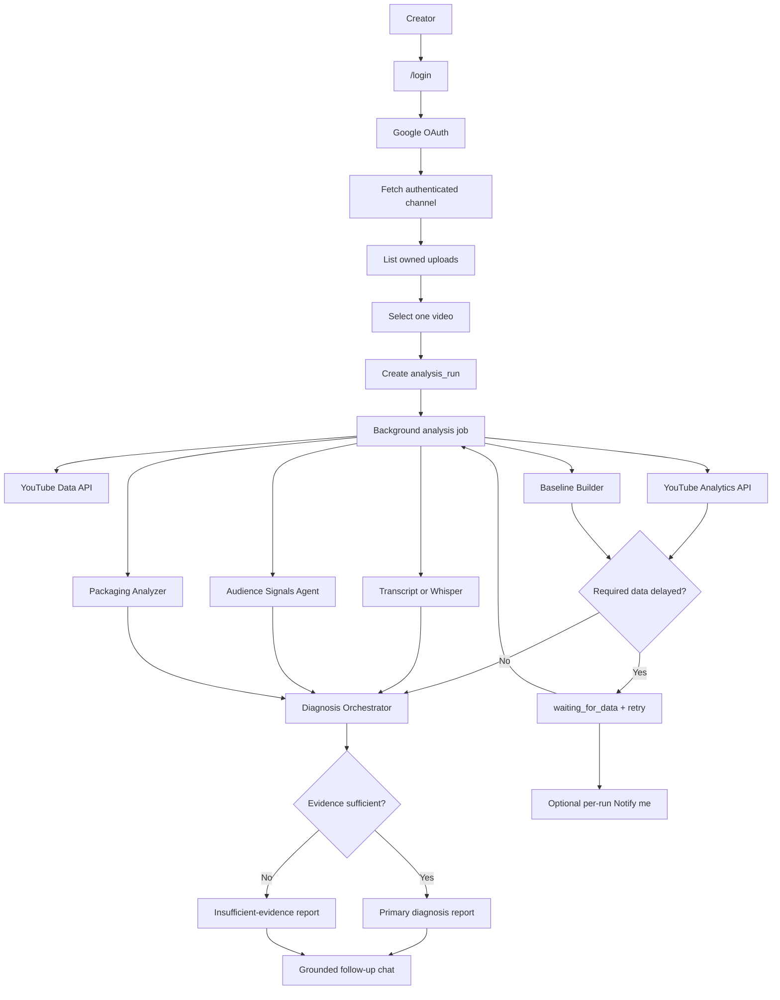

# Candor YouTube Video Performance Diagnosis

## Project Overview

Candor helps serious YouTube creators understand why one of their videos underperformed and what to change in the next upload.

The app is not a generic video chatbot. It is a report-first post-mortem system:

1. The creator connects YouTube.
2. The creator selects one owned video.
3. The system builds a channel-relative analysis snapshot.
4. The system generates an evidence-backed diagnosis report.
5. Follow-up chat is available only after the report exists.

The core product promise is reliability. If the data is insufficient to name a primary bottleneck, the product should say that clearly and ask for the specific missing context instead of producing a weak answer.

Candor is also not a clickbait title generator, thumbnail generator, generic AI coach, or way to copy bigger creators. It studies the creator's own channel, videos, audience patterns, and evidence limits.

## Product Documents

| Document | Purpose |
| --- | --- |
| [Product Spec](.codex/PRODUCT_SPEC.md) | Product scope, MVP requirements, diagnosis framework, and long-term direction |
| [Architecture](.codex/ARCHITECTURE.md) | OAuth, analysis runs, analyzers, schema, API direction, and evidence gates |
| [Plans](.codex/PLANS.md) | Pivot milestones and acceptance criteria |
| [Progress](.codex/Progress.md) | Current status, completed chunks, next step, and known issues |
| [Candor PRD](issues/prd.md) | Multi-page SaaS product plan from the latest design interrogation |
| [Agent Notes](AGENTS.md) | Developer workflow, product decisions, security rules, and implementation constraints |

## Current Pivot

This branch pivots away from the previous YouTube/Instagram two-video comparison demo.

What stays useful:

- FastAPI backend.
- Next.js frontend.
- Postgres storage.
- Qdrant vector search.
- Groq chat and Whisper wrappers.
- YouTube transcript fast path.
- `yt-dlp` and `ffmpeg` media extraction.
- Structured errors, progress states, and provider-mocked CI patterns.

What changes:

- One authenticated YouTube creator instead of generic public URLs.
- One selected owned YouTube video instead of Video A/Video B comparison.
- Long-form-only MVP diagnosis; Shorts are detected and excluded for now.
- Report-first workflow instead of chatbot-first workflow.
- Multi-page SaaS frontend: `/` landing, `/login` sign-in page, `/auth` permission detail page, `/app` authenticated workspace, and `/faq` trust page.
- `analysis_run` as the product object instead of `session_id`.
- Private YouTube Analytics and channel baseline as first-class evidence.
- Deterministic evidence gates before the LLM writes a diagnosis.
- Audience comment analysis as a bounded sub-agent.

## MVP Goal

Build an OAuth-connected YouTube diagnosis flow where a creator selects one underperforming owned video and receives a structured report explaining:

- where the video likely lost momentum;
- what evidence supports that conclusion;
- how confident the system is;
- what data is missing, if any;
- what to focus on next;
- what to ignore;
- how to improve the next upload.

## MVP Must-Haves

- Google/YouTube OAuth login.
- Read-only YouTube and YouTube Analytics scopes.
- Encrypted refresh-token storage.
- Connected channel identity.
- Owned video selection.
- Manual video selection without channel-wide underperformer scanning.
- Shorts exclusion for MVP diagnosis.
- Analysis-run creation.
- FastAPI background-task analysis execution with explicit run statuses.
- First-class `waiting_for_data` state for delayed required analytics, baseline, selected-video metadata, or ownership/channel verification.
- Lightweight durable retry metadata for waiting runs.
- Explicit per-run `Notify me` consent for delayed diagnoses.
- Resend transactional email behind a provider interface, with a fake provider for tests.
- Linked retry for failed analysis runs.
- Linked refresh and manual-context revision runs.
- Private analytics snapshot.
- First-7-day channel-relative baseline.
- Transcript ingestion and timestamped chunks.
- Comment analysis through an Audience Signals Agent.
- Retention-to-transcript mapping.
- Deterministic diagnosis JSON.
- Evidence gate and insufficient-evidence state.
- Structured report.
- Lightweight report feedback tied to each analysis run.
- Grounded follow-up chat attached to the report.
- Disconnect and delete-analysis-data paths.
- Provider-mocked tests.

## What The Product Must Avoid

- Instagram or multi-platform support in MVP.
- Generic chatbot-first UI.
- Automated thumbnail vision analysis in MVP.
- Unsupported claims about YouTube's algorithm.
- Invented CTR, impressions, retention, or private analytics.
- Naming a primary bottleneck when evidence is insufficient.
- Storing unlimited channel analytics data.
- Requesting write/manage YouTube scopes.
- Automatic waiting-run emails without explicit `Notify me`.
- Marketing newsletters, growth nudges, weekly reports, or reactivation emails.
- User-facing scores, grades, virality scores, thumbnail scores, hook scores, or confidence percentages.
- Pricing, billing, teams, or workspaces in the MVP UI.

## Architecture



## Diagnosis Model

The system follows:

```text
Signal -> Evidence -> Interpretation -> Confidence -> Action
```

Deterministic analyzers own:

- metric normalization;
- baseline selection;
- trend analysis;
- retention-to-transcript mapping;
- comment timestamp extraction;
- candidate bottleneck scoring;
- contradiction checks;
- evidence gates.

The LLM owns:

- creator-friendly explanation;
- coaching;
- hook and title rewrites;
- next-video planning;
- grounded follow-up responses.

The LLM does not get to invent analytics or choose the primary bottleneck from scratch.

## Evidence Gate

A primary bottleneck can be named only when the run has:

- one authenticated analytics signal;
- at least 5 comparable prior long-form videos in a same-window channel-baseline comparison;
- one content or audience signal;
- one candidate bottleneck materially stronger than alternatives;
- one contradiction check;
- confidence tied to data completeness.

If that bar is not met, the report should rank hypotheses, show missing data, and ask targeted questions.

Every factual report claim must cite stored evidence. Invalid report JSON or invalid machine-readable citations should be rejected before display.

## Expected API Direction

New product endpoints should target analysis runs:

| Endpoint | Purpose |
| --- | --- |
| `GET /auth/google/start` | Start Google OAuth |
| `GET /auth/google/callback` | Complete OAuth callback |
| `GET /me` | Return current user and connected channel state |
| `POST /youtube/disconnect` | Disconnect YouTube and remove stored token access |
| `DELETE /me/analysis-data` | Delete stored analysis data |
| `GET /youtube/channels` | List connected channels |
| `GET /youtube/videos` | List owned uploads |
| `POST /analysis-runs` | Create and start a background analysis run |
| `GET /analysis-runs/{id}` | Read run status and progress |
| `GET /analysis-runs/{id}/report` | Read generated report |
| `POST /analysis-runs/{id}/notify` | Request per-run notification for waiting data |
| `POST /analysis-runs/{id}/check-now` | Manually check a waiting run |
| `POST /analysis-runs/{id}/followups` | Ask grounded follow-up questions |

Legacy comparison endpoints may remain temporarily during migration, but new work should not extend them.

## Development Setup

The old local setup still mostly applies until the pivot implementation updates dependencies and environment variables.

Expected future environment variables:

```text
DATABASE_URL=
QDRANT_URL=
QDRANT_API_KEY=
GROQ_API_KEY=
GOOGLE_OAUTH_CLIENT_ID=
GOOGLE_OAUTH_CLIENT_SECRET=
GOOGLE_OAUTH_REDIRECT_URI=
TOKEN_ENCRYPTION_KEY=
EMAIL_PROVIDER=fake
RESEND_API_KEY=
EMAIL_FROM=
```

`GOOGLE_CLIENT_ID`, `GOOGLE_CLIENT_SECRET`, and `OAUTH_TOKEN_ENCRYPTION_KEY` are accepted as legacy aliases, but new local setup should use the `GOOGLE_OAUTH_*` names and `TOKEN_ENCRYPTION_KEY`.

OAuth development should use Google Cloud OAuth Testing mode with allowlisted test users.

## First Implementation Milestone

Build the Candor multi-page OAuth-connected analysis skeleton:

1. Build the static `/`, `/login`, `/auth`, `/app`, and `/faq` shell with Candor positioning and current auth/session plumbing.
2. Add Alembic-backed schema for `users`, `youtube_channels`, `oauth_tokens`, `analysis_runs`, waiting-run retry metadata, and notification attempts.
3. Implement Google OAuth start/callback and post-OAuth routing.
4. Store encrypted refresh tokens server-side.
5. Add `GET /me`.
6. Add `POST /youtube/disconnect`.
7. Fetch authenticated channel identity.
8. Fetch owned uploads through provider wrappers.
9. Create analysis runs and support `waiting_for_data`, linked retry, refresh, and manual-context revisions.
10. Add Resend/fake email provider support for explicit per-run `Notify me`.

Full diagnosis comes after this foundation is working.

## Quality Bar

The product is only valuable if creators trust it. The system should:

- cite evidence;
- expose uncertainty;
- wait and retry when required data is delayed;
- ask when data is missing;
- distinguish deterministic findings from coaching suggestions;
- avoid broad generic advice;
- keep private analytics secure;
- keep tests provider-mocked by default.
