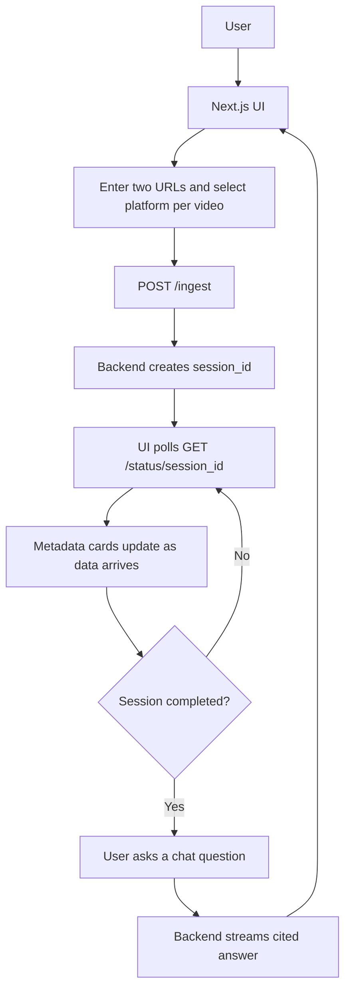
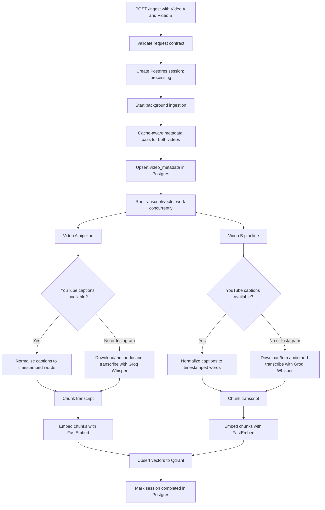
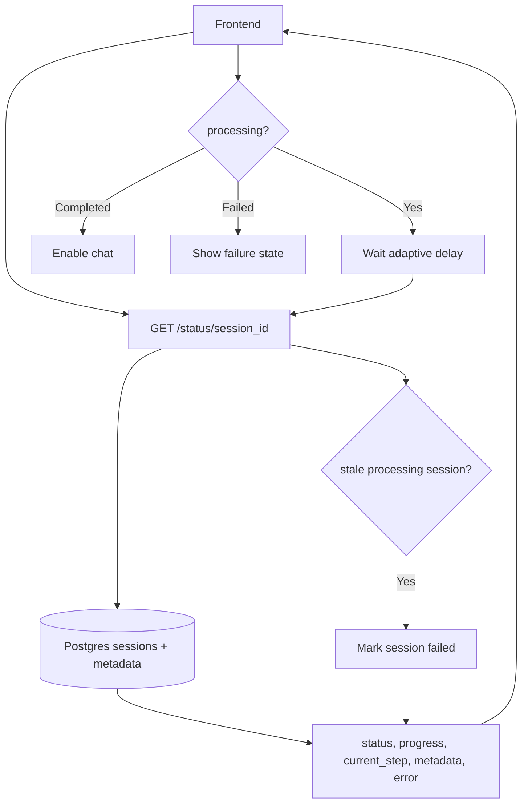
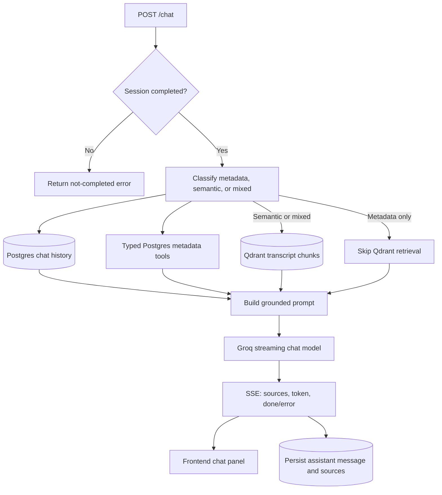
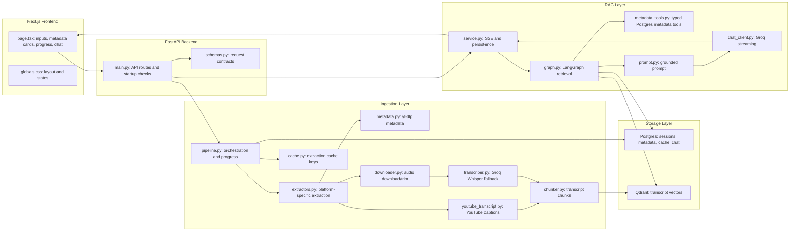

# Phase 1 — Thin Vertical Slice

## Scope

Phase 1 builds the first complete demoable version of the RAG chatbot. The goal is a working vertical slice, not a polished production system.

Included in this phase:

- FastAPI backend with ingest, status, health, messages, and streaming chat endpoints.
- Next.js frontend with two configurable video URL inputs, progress state, metadata cards, and chat.
- Background ingestion that returns a `session_id` immediately.
- Fresh page loads start from an empty UI state instead of restoring the previous session.
- Metadata extraction for two videos.
- Platform-specific extractors for YouTube and Instagram.
- Postgres extraction cache for repeatable demos, with `FORCE_REFRESH=true` to bypass cache reads.
- Raw extractor metadata and per-video ingestion diagnostics in Postgres.
- Engagement-rate calculation.
- Transcript extraction using YouTube captions when available and Groq `whisper-large-v3` fallback otherwise.
- Transcript chunking, embedding, and Qdrant storage.
- Durable session, metadata, and chat history storage in Neon Postgres.
- LangGraph retrieval path that loads metadata from Postgres and transcript chunks from Qdrant.
- Typed Postgres metadata tools for numeric, creator, engagement, and summary questions.
- Chat routing that bypasses Qdrant for numeric/metadata questions and uses Qdrant for transcript questions.
- Real SSE streaming from Groq.
- Source citations for metadata and transcript chunks.

Out of scope for this phase:

- Auth and multi-tenant permissions.
- Durable job queue.
- Automatic retry or resume for failed/stalled ingestion jobs.
- Redis.
- Hybrid retrieval, reranking, and query classification beyond simple routing helpers.
- Production observability.
- CI and provider-mocked test suite.

## Technologies Used

- Frontend: Next.js, React, TypeScript, CSS.
- Backend: FastAPI, Pydantic, SQLAlchemy.
- Orchestration: LangGraph.
- Chat LLM: Groq `llama-3.3-70b-versatile`.
- Embeddings: FastEmbed with `BAAI/bge-small-en-v1.5`.
- Vector DB: Qdrant Cloud with cosine vectors and payload filters.
- Relational DB: Neon Postgres.
- Metadata/audio extraction: `yt-dlp`.
- YouTube captions: `youtube-transcript-api`.
- Whisper fallback: Groq `whisper-large-v3`.
- Runtime media support: `ffmpeg`.

## User Flow At This Point

## Program Flow

### Ingest Flow

### Status Flow

### Chat Flow

## Component Flow

## Data Ownership

- Postgres is the source of truth for:
  - session status
  - progress
  - video metadata
  - raw extractor metadata
  - per-video ingest status, transcript source, failures, chunk counts, and cache flags
  - extraction cache entries
  - chat history

- Qdrant is the source of truth for:
  - embedded transcript chunks
  - semantic transcript retrieval
  - hook chunk retrieval

- Metadata is duplicated in Qdrant payloads only for retrieval context and citation support. Canonical metadata answers should come from Postgres.
- Numeric and creator metadata chat questions use typed Postgres metadata tools and skip Qdrant retrieval.
- Semantic transcript questions use Qdrant. Mixed comparison questions combine metadata tool results with transcript chunks.

## Decision Tradeoffs

- FastAPI over Node backend:
  - Better local support for `yt-dlp`, FastEmbed, LangGraph, and the Python Groq SDK.

- Groq over OpenAI for Phase 1 chat:
  - Faster and lower-cost for demo testing.
  - Later OpenAI migration remains isolated behind provider wrappers.

- FastEmbed/BGE over paid embedding APIs:
  - Lower cost and no embedding API dependency.
  - Retrieval quality may be lower than OpenAI embeddings, but is good enough for short transcript chunks.

- Qdrant Cloud over local Docker:
  - More realistic cloud demo.
  - Requires payload indexes for filtered search.

- Neon Postgres over SQLite:
  - Durable persisted state that survives refreshes and looks closer to production.
  - Slightly more setup through environment configuration.

- SQLAlchemy `create_all` over migrations:
  - Faster for Phase 1.
  - Later schema churn should move to Alembic migrations.

- YouTube captions before Whisper:
  - Much faster and cheaper for YouTube.
  - Captions may be unavailable or imperfect, so Whisper fallback remains.

- Groq Whisper fallback for Instagram:
  - More reliable than depending on platform transcript support.
  - Avoids local model downloads and CPU-bound transcription.

- Transcript cap through `MAX_VIDEO_SECONDS`:
  - Controls demo latency and cost for audio download plus Groq Whisper fallback.
  - YouTube captions are uncapped, so videos longer than 10 minutes can ingest when captions are available.
  - Full Whisper-based long-form analysis is deferred.

- Concurrent per-video transcript/vector work:
  - Greatly reduces two-video ingest time.
  - Requires thread-safe lazy initialization for shared clients/models.

- Postgres extraction cache for demo repeatability:
  - Reuses real prior extractor output for repeated demos.
  - `FORCE_REFRESH=true` bypasses cache reads when current platform data is needed.

- Per-video failure state:
  - Makes Instagram/download/transcription failures visible in `/status`.
  - The system does not fabricate fallback metadata or transcript chunks when extraction fails.

- Fresh page state over session auto-restore:
  - Avoids showing an old stuck progress state after refresh during Phase 1 demos.
  - Users start a new ingest manually after a malfunction.

- Stale-session failure guard over automatic retry:
  - `GET /status/{session_id}` marks old `processing` sessions as `failed` after `INGEST_STALE_SECONDS`.
  - This surfaces stopped background tasks to the frontend without adding retry behavior yet.
  - Future retry should be explicit and should preserve the original failure reason.

- Frontend network handling over treating every fetch failure as ingest failure:
  - Browser offline/API-unreachable states show a connection message and pause polling.
  - Polling resumes when the browser comes back online.

- FastAPI background task over durable queue:
  - Simple enough for the assignment demo.
  - Production should use a real job queue for retries, cancellation, and worker isolation.

- SSE through POST fetch instead of `EventSource`:
  - Allows request body with `session_id` and message.
  - Requires manual SSE parsing on the frontend.

- Rule-based chat routing for Phase 1:
  - Keeps numeric and creator answers grounded in Postgres.
  - Avoids vector retrieval for questions that can be answered exactly from metadata.
  - Leaves richer classification for Phase 2.

## Current Acceptance State

- Backend imports and compiles.
- Frontend production build passes.
- Health checks pass against Neon and Qdrant.
- Live mixed YouTube + Instagram Reel ingest completed on port 8001.
- Video A used captions and stored 27 chunks; Video B used Whisper and stored 3 chunks.
- YouTube captions are uncapped by `MAX_VIDEO_SECONDS`; long captioned YouTube videos ingest without using Whisper.
- Status responses expose raw-metadata presence, transcript source, chunk count, cache flags, and per-video failures.
- Repeat ingest hit the extraction cache for both metadata and transcripts.
- Bad Instagram URL smoke test failed visibly with Video B `ingest_status=failed`.
- Chat streamed cited answers with transcript chunks from both videos for compare questions.
- Numeric and creator metadata questions are routed to Postgres metadata tools and bypass Qdrant retrieval.
