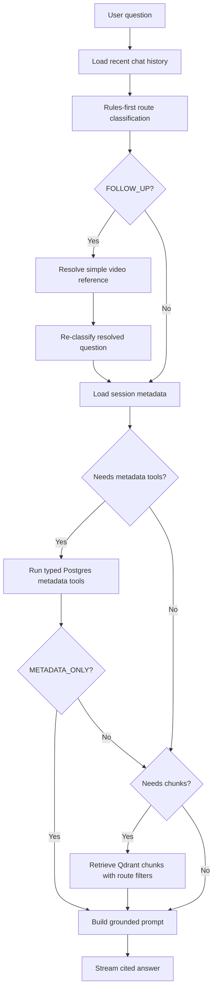

# Phase 2 — Grounded Intelligence

## Scope

Phase 2 improves answer grounding and routing so the chatbot uses the right source for the right type of question.

Included in this phase:

- Add rules-first LangGraph routing for metadata, transcript, hook, mixed comparison, improvement, and follow-up questions.
- Use typed metadata tools for numeric questions instead of free-form SQL or vector retrieval.
- Use transcript retrieval only for semantic and recommendation questions.
- Use first-5-second chunks for hook comparison.
- Resolve simple follow-up questions from recent chat context before routing.
- Add citation validation for metadata and transcript claims.
- Add an eval script for the assignment's required question set.

Out of scope for this phase:

- Major UI redesign.
- Multi-user auth.
- Production monitoring.
- Full hybrid search or reranking unless eval results prove it is necessary.

## Current Eval Harness

`backend.evals.assignment_eval` runs the assignment's five required questions against a completed backend session:

- What is the engagement rate of each video?
- Who is the creator of Video B and what is their follower count?
- Compare the hooks in the first 5 seconds.
- Why did Video A get more engagement than Video B?
- Suggest improvements for B based on what worked in A.

The eval uses the existing streaming `/chat` API. It validates that responses stream to a successful done event, answers are non-empty and cited, numeric answers match available Postgres-backed status metadata, unavailable metrics are stated as unavailable, metadata-only questions return metadata sources without transcript chunks, hook questions use first-5-second chunk sources, and mixed comparison questions include transcript evidence from both videos.

Run it with:

```bash
backend/.venv/bin/python scripts/eval_assignment_questions.py \
  --api-base http://127.0.0.1:8000 \
  --session-id <completed-session-id>
```

## Router Decision

Phase 2 uses a deterministic rules-first router instead of an LLM classifier. This keeps routing cheap, inspectable, and easy to test against the assignment questions. An LLM classifier is deferred until eval results show the rules are too brittle.

Internal routes:

- `METADATA_ONLY`: numeric, creator, follower, view, like, comment, duration, upload, and hashtag questions. Uses Postgres typed tools only and skips Qdrant.
- `TRANSCRIPT_ONLY`: semantic content questions. Uses Qdrant transcript retrieval.
- `HOOK_COMPARISON`: hook or first-five-second questions. Uses Qdrant retrieval filtered with `is_hook=true`.
- `MIXED_COMPARISON`: causal performance comparisons, such as why one video got more engagement. Uses Postgres metadata tools and Qdrant transcript chunks.
- `IMPROVEMENT_SUGGESTION`: recommendation questions. Uses metadata, Video A evidence for what worked, and Video B evidence for improvement opportunities.
- `FOLLOW_UP`: short/pronoun follow-ups. Resolves simple references such as "their", "that video", and "what about B" from recent chat history, then re-routes.

## Current Program Flow



## Tradeoffs

- Rules-first routing is less flexible than an LLM classifier, but safer for the current assignment because route behavior is deterministic and covered by unit tests.
- Follow-up handling is intentionally minimal. It resolves obvious video references, but does not rewrite every conversational turn.
- Improvement retrieval uses targeted Video A and Video B semantic queries instead of reranking. Reranking remains out of scope unless evals prove retrieval quality is the bottleneck.
